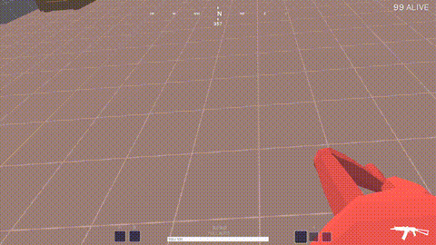

# TABG VR
[ENG | [РУС](README_RU.md)]

## Installation
[Refer to the Setup Guide for installation instructions.](SETUP.md)

[Alternatively, refer to the Compiling Guide for compilation instructions.](COMPILING.md)

## Controller Layout

(NOTE: Snap Turn, Grenades, and Fire Mode are not implemented yet!)