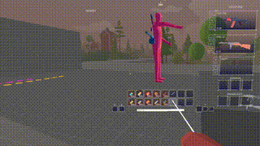
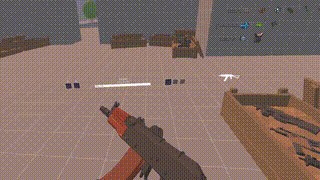
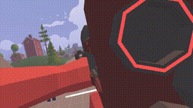
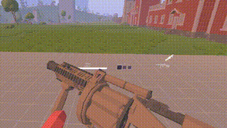

# TABG VR

[ENG | [РУС](README_RU.md)]

[//]: # (![Shooting Test]&#40;img/demos/ak_shoot_old.gif&#41;)

## Installation
[Refer to the Setup Guide for installation instructions.](SETUP.md)

[Alternatively, refer to the Compiling Guide for compilation instructions.](COMPILING.md)

## Controller Layout
