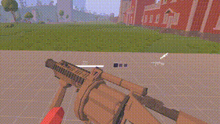

# TABG VR

[[ENG](README.md) | РУС]

[//]: # (![Тест стрельбы]&#40;img/demos/ak_shoot_old.gif&#41;)

## Установка
[См. Руководство по установке для инструкций по установке](SETUP_RU.md)

[Также см. Руководство по компиляции для инструкций по компиляции](COMPILING_RU.md)

## Раскладка контроллера
